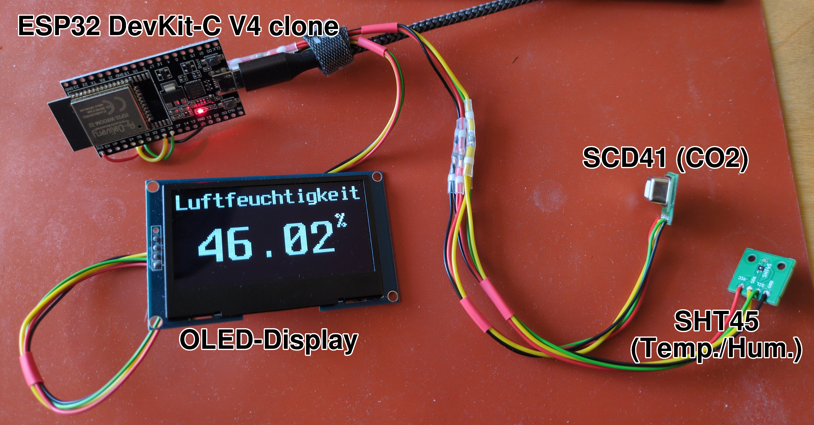

# foxesptemp2023

## Intro

The goal of this project is to build a ESP32 based version of my previous AVR based FoxTemp devices, like e.g. [FoxTemp2016](https://gitlab.cs.fau.de/PoempelFox/foxtemp2016) and [FoxTemp2022](https://gitlab.cs.fau.de/PoempelFox/foxtemp2022).

It uses the ESPs normal WiFi, instead of transmitting values on 868 MHz to a special receiver.

For very obvious reasons, it uses an order of magnitude more power than the AVR based FoxTemps. It is not possible to power this from 2 AA batteries like the AVR based Foxtemps, you will need to plug this into an USB (wall) power supply.

On the plus side, this does have a webinterface, and it is quite flexible with regard to what sensors you connect to what pin. It can also submit values to servers on the internet on its own.

## Status

As of May 2024 this is working quite well. Multiple units with this firmware have been deployed by now, using a varying set of sensors.

## Working features

* Simple web-interface that can show you the current measurements. The measurements are also available as a JSON-file under the URL `/json`, for automatic processing of these measurements.
* password-protected admin-webinterface, where you can configure everything. This firmware does not have any compiled in settings, everything is set up through that admin interface, including but not limited to what sensors you have, and on which I/O-pins of the ESP they are connected.
* Over-The-Air (OTA) firmware-updates with support for rollback in the case of problems
  - Note that new firmware cannot be directly uploaded through the webbrowser, but instead you have to put the file on a HTTPS-server that the ESP can reach, and then tell it (in the admin-webinterface) to update its firmware from that URL.
  - After a new firmware has been flashed, the ESP32 will boot into that firmware. If the firmware works fine, you can log into the admin-webinterface, and mark the new firmware as "good". Only then will the new firmware become permanent. Otherwise, on the next reset/reboot, the previous firmware will automatically be restored.
* Support for a number of different sensors.
  - Please note that you can only connect one of each sensor-type. For example, you cannot connect two temperature-sensors.
  - However, there is no limitation on the number of different sensor-types that you can connect.
* Supported sensor-types
  - SHT4x (e.g. SHT41 / SHT45) temperature/humidity sensor
  - SEN50 particulate matter sensor
  - SCD41 CO2-sensor
  - LPS35HW pressure sensor
  - RG15 rain sensor
* Support for a local display to show the measured values.
* Supported display-types
  - ...

## Planned features

* Support for further sensor types
  - SGP40
* Support for further display types
* Submitting data to more online services.
  - opensensemap
  - support for sensor.community (or madavi) is not planned, because they give the impression they do not want to collect any measurements not stemming from one of their sensors. Unless you lie to the API that you're a sensor.community-sensor, your measurements either get silently dropped, or refused with an error message.
  - "custom own"

## How to use

* Take an ESP32 devboard.
  - As long as it is a normal ESP32 (NOT an ESP32-S2 or something like that) and has at least 4 MB of flash, chances are it will just work.
  - Known working boards include
    + "ESP32 Devkit C V4" from AZ-delivery
    + Waveshare E-Paper ESP32 driver board
  - If you want to use different ESP types, like an ESP32-S2, you _will_ have to change a few parameters, like the target type, before compiling, but with a bit of luck no code changes should be required.
* Set a password for the WiFi AP that the firmware will open in the file `espfw/main/defaultwifiappw.h`
* Compile the firmware contained in this repository under the directory `espfw` with ESP-IDF. I will not go into further detail on how to achieve this.
* Flash the firmware to the ESP. I will not go into further detail on how to achieve this.
* Solder or otherwise connect your sensors and display (if any) to the ESP32.
* Configure the firmware on the ESP. There are two main ways to accomplish this:
  - Through WiFi
    + Without any pre-existing configuration, the firmware will open up an access-point with a name like 'foxtempX', where X is the mac address of the ESP32. Note: If you did not follow the advice above to set an initial password, this is an open network, which means all data will be completely unencrypted. This may be fine if you do initial configuration in the middle of nowhere, where nobody else is in WiFi range, but otherwise, it is not a good idea.
    + Connect to that accesspoint with a laptop or smartphone
    + The webinterface on the ESP should be available under the URL [http://10.5.5.1](http://10.5.5.1) (note: HTTP, _not_ HTTPS).
    + Click on the "Admin Login" in the upper right corner. The default admin password is "admin".
    + Now change the settings as desired. Start with connectivity (you probably want this to connect to an existing accesspoint instead of opening its own) and admin password. Then configure the sensors.
    + Note that any and all changes only take effect after a Reboot. There is a 'reboot' button in the admin interface.
  - Through the serial console
    + Unless support for serial console wasn't compiled in, you can just use the console to enter commands and do basic configuration in that way. I would recommend to set only critical information like WiFi credentials or the admin password this way, as the console commands do not do any sanity checking and will permit you to set anything. Configuration like the type of sensors should be done through the webinterface.
    + `nvs_set_u8 wifi_mode 1` (1 for client mode, 0 for access-point mode)
    + `nvs_set_str wifi_cl_ssid YOURSSID` (or wifi_ap_ssid if you try to configure an accesspoint)
    + `nvs_set_str wifi_cl_pw YOURWIFIPASSWORD`
    + `nvs_set_str adminpw YOURNEWADMINPASSWORD`
    + note that everything will only take effect after a reboot, e.g. with command `restart`

